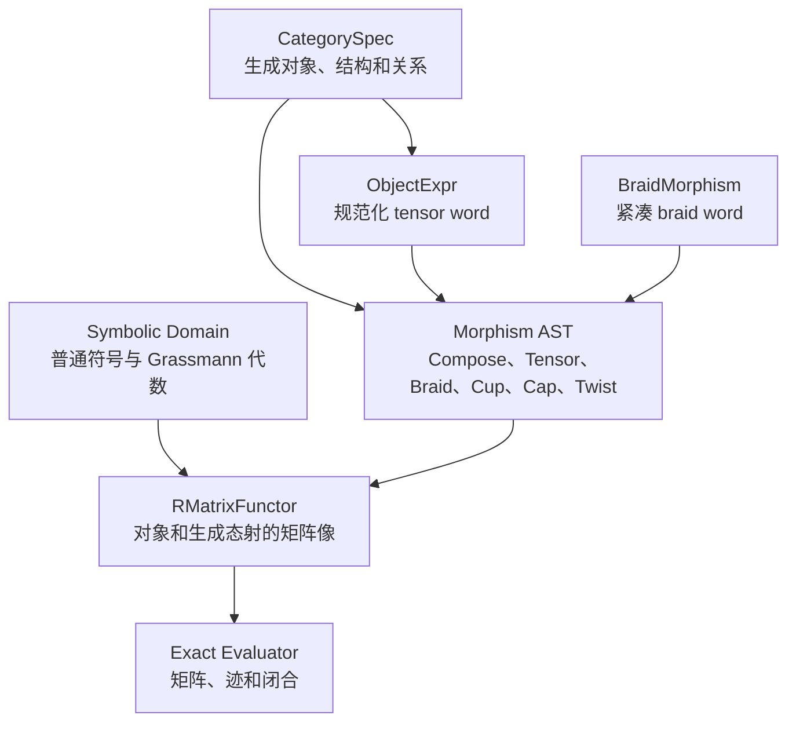

# Monoidal Category 扭结不变量符号计算包：开发计划

## 1. 项目目标

构建一个面向数学实验的 Python 包，通过用户提供的有限维 R 矩阵计算 framed braid closure，并为后续扩展到一般 ribbon category、平面 tangle 图和更多扭结不变量保留稳定接口。

第一版优先保证：

- 数学约定明确；
- 所有计算保持符号精确；
- 对象和态射具有严格的 domain/codomain 类型检查；
- 用户可以更换 R 矩阵，而不必重新构造 tangle；
- 明确区分“完成一次矩阵求值”和“已经验证得到不变量”；
- 代码可测试、可序列化、便于以后升级。

第一版不以高性能或任意扭结图输入为目标。

## 2. 总体架构



架构分成三层：

1. **抽象范畴层**：记录对象、态射、张量、对偶、braiding、cup、cap 和 twist，不包含具体 R 矩阵。
2. **符号与表示层**：记录普通符号、Grassmann 变量、精确矩阵以及用户给出的 R 矩阵函子。
3. **求值层**：把抽象态射映射成矩阵，执行复合、张量积、闭合和迹运算，并报告验证状态。

## 3. 已确定的数学约定

### 3.1 范畴类型

第一版内部使用 strict linear pivotal ribbon category 的接口：

- 结合子和 unitors 不作为显式 AST 节点；
- tensor object 使用扁平 tensor word；
- 双对偶严格识别为原对象；
- 保留 braiding、左右 cup/cap 和 twist 的显式节点；
- 第一版结构态射均为偶态射。

### 3.2 Unit object

Unit object 使用空 tensor word：

```text
I         -> ()
V         -> (V,)
V tensor W -> (V, W)
```

因此 `I tensor A` 和 `A tensor I` 在构造时自然规范化为 `A`。

不同范畴的 unit 由 `category_id` 区分。对象 `I`、恒等态射 `id_I` 和标量态射 `s: I -> I` 是三个不同概念。

### 3.3 Grassmann 变量

符号引擎完整支持反交换 Grassmann 变量：

```text
theta_i theta_j = -theta_j theta_i
theta_i^2 = 0
```

每个符号表达式能够报告 `EVEN`、`ODD`、`MIXED` 或 `ZERO` parity。

第一版 R 矩阵元只允许偶 Grassmann 表达式或零。例如：

```text
q + theta_1 theta_2   允许
q + theta_1           拒绝
```

符号引擎仍允许独立构造和计算任意奇表达式。完整的奇 R 矩阵、graded basis 和 Koszul tensor product 留到后续 supercategory 扩展。

### 3.4 R 矩阵约定

用户必须明确声明输入类型：

- `convention="check"`：输入满足 braid relation 的 `check_R`；
- `convention="quantum"`：输入满足 quantum Yang-Baxter equation 的 `R`，由程序使用 swap 转换为 `check_R`。

第一版默认推荐用户直接输入 `check_R`，避免交换算子约定造成混淆。

### 3.5 Framing 和闭合

第一版计算 framed braid closure。一个完全闭合的 tangle 必须具有类型：

```text
I -> I
```

其矩阵表示是 `1 x 1`，最终返回唯一的符号元素。

R 矩阵本身不保证产生扭结不变量。程序必须分别报告：

- 矩阵尺寸是否正确；
- R 是否可逆；
- Yang-Baxter 方程是否成立；
- quantum trace/closure 数据是否兼容；
- 结果只是 raw evaluation，还是通过了当前实现能够检查的不变量条件。

## 4. 核心数据结构

### 4.1 `CategorySpec`

职责：提供稳定的范畴身份和对象、coupon、结构态射工厂。

阶段 1 字段：

```python
CategorySpec(
    id: str,
    name: str | None = None,
)
```

`id` 是对象和态射使用的语义身份；同一个 `id` 表示同一个范畴。第一版固定使用
strict pivotal ribbon 表示，不暴露一组恒为真的能力开关。标量域、关系注册表和生成元注册表
等到有实际消费者时再加入。内部数据结构从阶段 1 起支持多个生成对象。

### 4.2 `ObjectExpr`

对象使用不可变、可哈希的规范化 tensor word：

```python
ObjectExpr(
    category_id: str,
    factors: tuple[ObjectFactor, ...],
)
```

`ObjectFactor` 至少记录：

```python
ObjectFactor(
    generator_id: str,
    dual: bool,
)
```

规范化规则：

- unit 是空 tuple；
- tensor 通过 tuple 拼接实现；
- 不保存括号；
- `dual(A tensor B) = dual(B) tensor dual(A)`；
- strict pivotal 模式下 `dual(dual(A)) = A`；
- 禁止对不同 `category_id` 的对象做 tensor。

### 4.3 `Morphism` AST

每个态射节点不可变、可哈希，并缓存或可靠计算：

```python
Morphism(
    dom: ObjectExpr,
    cod: ObjectExpr,
    node: MorphismNode,
)
```

第一版节点：

- `Identity`；
- 用户自定义的 typed `Coupon`；
- `Compose`；
- `Tensor`；
- 正、负 colored `Braiding`；
- `LeftEvaluation`、`RightEvaluation`；
- `LeftCoevaluation`、`RightCoevaluation`；
- `Twist` / inverse twist。

`Add` 和 `Scale` 依赖标量域、零判定和系数规范化，因此移到阶段 2，不在结构 AST
中先放无语义的占位节点。

构造器必须立即检查：

- 复合时前一态射的 codomain 等于后一态射的 domain；
- tensor 两侧属于同一个范畴；
- cup、cap 和 braiding 的对象方向正确；
- 手动组装的 AST node payload 与外层 domain/codomain 一致。

基础规范化：

- 扁平化嵌套的 `Compose` 和 `Tensor`；
- 消去复合中的 identity；
- 消去 tensor 中的 `id_I`；
- 不在第一版自动执行通用 Reidemeister/string-diagram 重写。

### 4.4 `BraidMorphism`

braid word 使用紧凑节点：

```python
BraidMorphism(
    objects: ObjectExpr,
    word: tuple[int, ...],
)
```

例如：

```python
BraidMorphism(V.tensor(W).tensor(V), word=(1, -2, 1))
```

表示带初始颜色词 `(V, W, V)` 的 `sigma_1 sigma_2^-1 sigma_1`。每次 crossing
交换相邻对象，所以 codomain 由整个 word 作用后的对象顺序决定，不再假定等于 domain。

验证规则：

- `strands` 从 `objects` 的 factor 数量导出且至少为 1；
- 每个生成元满足 `1 <= abs(i) < strands`；
- 正数表示正 crossing，负数表示 inverse crossing；
- `word=()` 表示对应 tensor power 上的 identity；
- 能够计算 bottom object word、inverse、writhe，并在需要时展开成一般 `Morphism` AST；
- colored closure 必须另外检查闭合后各分量的颜色兼容性。

### 4.5 `RMatrixFunctor`

R 矩阵属于函子/表示层，不存入抽象 `Braiding` 节点。

计划接口：

```python
RMatrixFunctor(
    source: CategorySpec,
    object_map: dict[ObjectGenerator, VectorSpaceSpec],
    r_matrices: dict[tuple[ObjectExpr, ObjectExpr], RMatrixSpec],
    evaluation_map: dict,
    coevaluation_map: dict,
    twist_map: dict,
    trace_data: TraceData | None,
)
```

固定矩阵约定：

- `f: A -> B` 的矩阵形状是 `dim(B) x dim(A)`；
- `f.then(g)` 的矩阵是 `M_g @ M_f`；
- tensor basis 使用固定的字典序；
- 第一版使用普通 Kronecker product；
- R 的所有矩阵元必须通过偶性检查；
- 所有对象像的维数必须为正整数。

### 4.6 `ExactEvaluator`

求值器递归解释态射：

- `Identity` -> 单位矩阵；
- `Compose` -> 精确矩阵乘法；
- `Tensor` -> Kronecker product；
- `Braiding` -> 用户提供的 `check_R` 或其逆；
- cup/cap/twist -> 函子中配置的矩阵；
- `Add`/`Scale` -> 精确矩阵加法和标量乘法；
- 闭合结果 `I -> I` -> 返回 `1 x 1` 矩阵的唯一元素。

求值应使用缓存，但缓存键只能依赖不可变 AST 和函子配置标识。

## 5. 符号域设计

### 5.1 普通系数

第一版使用 SymPy 处理：

- 整数和有理数；
- 普通交换符号；
- Laurent 幂；
- 有理函数；
- 形式指数；
- 展开、因式分解、代入和零判断。

所有公开表达式由包自己的薄封装管理，避免让范畴层直接依赖 SymPy 的内部类结构。

### 5.2 Grassmann 单项式

Grassmann 单项式使用有序变量集合或整数 bitset 表示。bitset 方案优先，因为它可以快速完成：

- 重复变量检测；
- degree 和 parity 计算；
- 乘积变量集合合并；
- 规范顺序符号计算。

Grassmann 表达式使用稀疏映射：

```python
dict[GrassmannMonomial, BaseScalarExpr]
```

### 5.3 除法和指数

若 `x = a + n`，其中 `a` 是可逆的 degree-0 部分、`n` 幂零，则使用有限几何级数计算 `x^-1`。

纯奇元素如 `theta_1` 不可逆，`1 / theta_1` 必须报明确错误。

指数对幂零部分有限展开。若表达式可写成可交换的 `a + n`，计划计算：

```text
exp(a + n) = exp(a) * exp(n)
```

其中 `exp(n)` 自动有限截断。对于不满足安全拆分条件的表达式，保留为形式表达式或报告当前不支持，不擅自使用错误恒等式。

## 6. 态射相等性的边界

第一版明确区分：

1. **语法相等**：规范化 AST 完全相同；
2. **关系相等**：由范畴关系或 string-diagram 重写得到；
3. **表示下相等**：在指定 R 矩阵函子下，两个精确矩阵相同。

第一版的 `==` 只表示语法相等。

第一版实现表示下的精确验证：

```python
verify_equal(f, g, functor=model)
```

通用 string-diagram 等价判定和自动 Reidemeister 重写不属于第一版范围。

## 7. 计划中的包结构

```text
monoidal-knot/
├── pyproject.toml
├── README.md
├── src/
│   └── monoidal_knot/
│       ├── __init__.py
│       ├── symbolic/
│       │   ├── base.py
│       │   ├── grassmann.py
│       │   ├── parity.py
│       │   └── matrix.py
│       ├── category/
│       │   ├── spec.py
│       │   ├── objects.py
│       │   ├── morphisms.py
│       │   ├── structural.py
│       │   └── relations.py
│       ├── braid/
│       │   ├── word.py
│       │   └── closure.py
│       ├── functor/
│       │   ├── r_matrix.py
│       │   ├── trace.py
│       │   └── evaluator.py
│       ├── validation/
│       │   ├── yang_baxter.py
│       │   └── invariant.py
│       └── serialization/
│           └── json.py
├── examples/
│   ├── basic_grassmann.py
│   ├── custom_r_matrix.py
│   └── jones_r_matrix.py
└── tests/
    ├── test_grassmann.py
    ├── test_objects.py
    ├── test_morphisms.py
    ├── test_braid.py
    ├── test_r_matrix.py
    └── test_closure.py
```

实际初始化项目时，可直接让仓库根目录承担上面 `monoidal-knot/` 的角色，不再额外嵌套一层同名目录。

## 8. 分阶段实施计划

### 阶段 0：项目骨架与约定

- [x] 创建 Python 包骨架和测试配置；
- [x] 固定 Python 最低版本；
- [x] 固定矩阵行列、复合顺序、tensor basis 和 crossing 符号约定；
- [x] 写最小 README 和开发命令；
- [x] 建立异常类型与验证报告类型。

验收条件：包可以安装、导入，空测试集和静态检查能够运行。

### 阶段 1：CategorySpec、对象和态射 AST

- [x] 最小 `CategorySpec`；
- [x] 多对象生成元和规范化 tensor word；
- [x] unit object 与 chosen pivotal dual；
- [x] identity、用户自定义 typed coupon、compose、tensor；
- [x] 正负 colored braiding、cup、cap、twist；
- [x] domain/codomain 类型检查；
- [x] 基础 AST 规范化和哈希。

验收条件：unit、结合、dual、typed composition、多对象 crossing 和任意 tensor-word coupon
测试通过；非法复合及 node/type 不一致在构造时被拒绝。阶段 1 不依赖或处理 Grassmann 变量。

### 阶段 2：符号与 Grassmann 引擎

- [x] 普通符号薄封装；
- [x] 显式 Grassmann 变量注册表；
- [x] bitset 单项式；
- [x] 规范化加减乘法；
- [x] parity 检测；
- [x] 安全除法；
- [x] 整数幂和指数；
- [x] 最小不可变精确矩阵及元素互操作。

阶段 2 不向抽象 `Morphism` AST 加入 `Add`、`Scale`、零态射或 scalar morphism；线性
运算只在精确矩阵层发生。若以后需要抽象态射的线性组合，将作为独立扩展设计。

验收条件：精确通过反交换、幂零、逆元和指数的单元测试；不能把有奇部分的 R 矩阵元误判为偶元素。

### 阶段 3：BraidMorphism

- [x] 整数 tuple braid word 的解释和验证；
- [x] identity braid；
- [x] inverse 和 writhe；
- [x] 紧凑 braid 节点；
- [x] 展开到一般 Morphism AST；
- [x] framed closure 的抽象表示。

结构验收条件：基本 braid relation 两侧可以构造为类型正确的 AST；colored closure 会拒绝顶部和
底部对象词不一致的 braid。字符串 braid 语法不属于本阶段范围。

原计划中“在合格的 R 表示下精确求值得到相同矩阵”的数学验收需要阶段 4 的函子和求值器，
按当前实施决定延后到阶段 4，不把本阶段的结构测试表述为 Yang--Baxter 验证。

### 阶段 4：RMatrixFunctor 与精确求值器

- [x] 对象维数映射；
- [x] `check_R` 输入；
- [x] quantum R 到 `check_R` 的转换；
- [x] R 逆矩阵；
- [x] AST 递归求值；
- [x] braid word 的局部 R 作用；
- [x] 在合格的 R 表示下精确验证基本 braid relation；
- [x] ordinary trace；
- [x] quantum trace；
- [x] cup/cap/twist 映射；
- [x] `I -> I` 标量提取。

验收条件：同一个 braid 可以使用两套不同 R 数据求值；所有结果保持精确符号形式。

实施边界：阶段 4 递归解释当前实际存在的 AST 节点，并额外支持显式配置 typed coupon 的矩阵像。
抽象 `Morphism` 仍不加入 `Add`/`Scale`；线性组合只在 `ExactMatrix` 层发生。quantum trace
按显式权重计算 raw categorical closure，R/trace/ribbon 数据的通用兼容性报告仍属于阶段 5。

### 阶段 5：验证器与第一个完整示例

- [x] R 尺寸和偶性验证；
- [x] 可逆性验证；
- [x] braid-form Yang-Baxter 方程验证；
- [x] quantum-form Yang-Baxter 方程验证；
- [x] trace/closure 兼容条件验证；
- [x] 区分 raw evaluation 与 verified invariant；
- [x] 加入一个二维 Jones R 矩阵示例；
- [x] 计算 unknot、简单 framed links 和 trefoil 示例；
- [x] 明确记录 framing 和归一化约定。

验收条件：已知示例与独立手算或可信公式一致；验证报告不会把未验证的用户 R 数据称为扭结不变量。

实施边界：阶段 5 的完整证书针对单对象 homogeneous R 数据。验证器精确检查 `check_R`
的 braid-form YBE、由 `R = P @ check_R` 得到的 quantum-form YBE，以及 enhanced
Yang--Baxter operator 的 trace-weight 交换和正负 Markov 稳定化偏迹恒等式。一般多颜色
heterogeneous YBE 系统仍可在阶段 4 API 中求值，但当前不会被提升为 `verified_invariant`。
另提供 `verify_yang_baxter(object=None)` 轻量入口；它只检查所选 homogeneous R 的两种
YBE 形式，不要求可逆性、trace 或 Markov 数据，也不产生不变量声明。

### 阶段 6：文档和可复现实验

- [x] 写用户自定义 R 矩阵教程；
- [x] 写 Grassmann 偶矩阵元示例；
- [x] 写 convention 错误的诊断示例；
- [x] JSON 序列化 Category/Object/Morphism/Braid 配置；
- [x] 保存每次实验的 R、braid word、trace 数据和验证状态。

验收条件：新用户可以只阅读 README 和示例，完成一次自定义 R 的 framed braid closure 计算。

## 9. 第一版用户 API 草案

```python
from monoidal_knot import (
    RibbonCategory,
    GrassmannSymbol,
    Symbol,
    Matrix,
    RMatrixFunctor,
    QuantumTrace,
    Braid,
)

q = Symbol("q")
theta1 = GrassmannSymbol("theta1")
theta2 = GrassmannSymbol("theta2")

C = RibbonCategory("experiment")
V = C.object("V")
I = C.unit

assert I @ V == V
assert V @ I == V

check_R = Matrix([
    # 用户给出的偶 Grassmann 矩阵元
])

model = RMatrixFunctor(
    source=C,
    object_map={V: 2},
    check_r={(V, V): check_R},
    trace=QuantumTrace(mu=mu),
)

report = model.verify()

b = Braid(V, strands=3, word=(1, -2, 1))
value = model.close(b)

print(report)
print(value)
```

最终 API 名称可以在实现阶段微调，但数学对象之间的分层和职责不应改变。

## 10. 测试原则

- 符号测试必须使用精确相等，不用浮点近似；
- Grassmann 乘法同时测试结果和符号；
- 每个 AST 构造器都测试合法和非法类型；
- unit object、`id_I` 和 scalar morphism 分别测试；
- Yang-Baxter 方程两侧独立构造后比较；
- 对用户输入的 R，验证失败必须给出失败条件和非零残差；
- 有限测试或若干样例相等不能被描述成一般数学证明；
- Jones 示例必须记录使用的 R、trace、framing 和变量约定。

## 11. 第一版之外的升级方向

- 完整 monoidal supercategory 和奇 R 矩阵元；
- graded basis、奇态射和 Koszul tensor product；
- 多对象/多颜色 tangles；
- port graph/string diagram 中间表示；
- Reidemeister 和 ribbon relations 重写；
- PD code、Gauss code、DT code 输入；
- 稀疏矩阵和 tensor-network 求值；
- HOMFLY-PT、Alexander 和一般 Reshetikhin-Turaev 后端；
- 自动生成计算证书和实验报告。

## 12. 实现约定的当前状态

- [x] Python 最低版本：3.12；
- [x] SymPy 最低版本：1.14，且第一版限制在 2.0 以下；
- [x] braid word 的执行、拼接和显示方向；
- [x] 正 crossing 对应 `check_R`；
- [x] cup/cap 的左右类型和矩阵 basis 顺序；
- [x] framed closure 默认要求显式 categorical/quantum trace，不静默使用 ordinary trace；
- [x] Jones 示例固定使用 `q`、`t=q^-2`、`alpha=q^2`、`beta=1` 和 `V(unknot)=1` 的总缩放；raw blackboard framing 与 verified normalization 分开记录。

这些约定一旦进入已发布的序列化格式，就不应在没有版本迁移的情况下改变。
